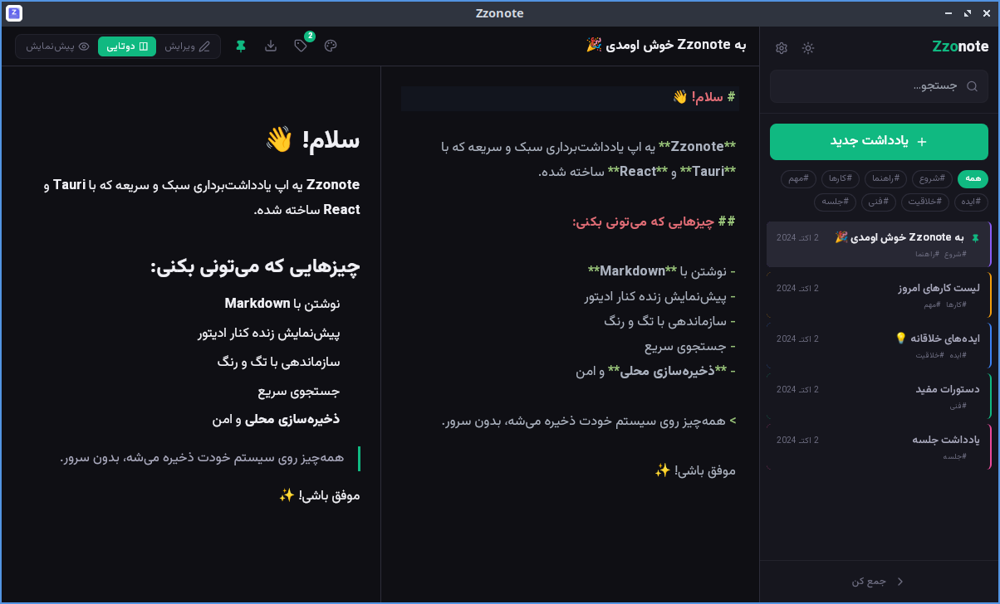

# ✍️ Zzonote

**یادداشت‌های سبک و سریع — ساخته‌شده با Tauri و React**

 

 

**اپلیکیشن یادداشت‌برداری دسکتاپ با پشتیبانی کامل از Markdown، تگ‌گذاری، و ذخیره‌سازی محلی**

 

[دانلود](#-نصب-و-اجرا) · [قابلیت‌ها](#-قابلیت‌ها) · [توسعه](#-توسعه)

---

## ✨ قابلیت‌ها

<table>
<tr>
<td width="50%">

### 📝 ویرایشگر
- **Markdown کامل** با CodeMirror 6
- **پیش‌نمایش زنده** کنار ویرایشگر
- سه حالت نمایش: ویرایش / دوتایی / پیش‌نمایش
- **ذخیره‌ی خودکار** (بدون دکمه Save)
- پشتیبانی از RTL و فونت وزیرمتن

</td>
<td width="50%">

### 🎨 ظاهر
- **تم روشن/تاریک** با یک کلیک
- **۸ رنگ Accent** قابل انتخاب
- **رنگ اختصاصی** برای هر نوت
- **فونت و اندازه‌ی قابل تنظیم**
- طراحی مینیمال و مدرن

</td>
</tr>
<tr>
<td width="50%">

### 🏷️ سازماندهی
- **تگ‌گذاری** با فیلتر
- **سنجاق کردن** (Pin) نوت‌های مهم
- **جستجوی زنده** بین همه نوت‌ها
- مرتب‌سازی خودکار بر اساس آخرین ویرایش

</td>
<td width="50%">

### 💾 داده‌ها
- **ذخیره‌سازی محلی** (بدون سرور)
- **پشتیبان‌گیری** JSON
- **بازیابی** از فایل پشتیبان
- **Export** به Markdown / HTML / PDF

</td>
</tr>
<tr>
<td width="50%">

### ⌨️ Shortcuts
| کلید | عملکرد |
|------|---------|
| `Ctrl+N` | یادداشت جدید |
| `Ctrl+F` | جستجو |
| `Ctrl+P` | سنجاق کردن |
| `Ctrl+B` | جمع/باز سایدبار |
| `Ctrl+,` | تنظیمات |
| `Delete` | حذف یادداشت |

</td>
<td width="50%">

### 🖥️ پلتفرم
- 🐧 **Linux**: `.deb` + `.AppImage` + `.rpm`
- 🪟 **Windows**: `.msi` + `.exe`
- 🍎 **macOS**: `.dmg` (Intel + Apple Silicon)
- حجم خروجی: **~۴ مگ** (به لطف Tauri)

</td>
</tr>
</table>

---

## 📦 نصب و اجرا

### لینوکس

نصب از فایل .deb:

    sudo dpkg -i Zzonote_0.1.0_amd64.deb

یا اجرای مستقیم AppImage:

    chmod +x Zzonote_0.1.0_amd64.AppImage
    ./Zzonote_0.1.0_amd64.AppImage

> فایل‌ها رو از Releases دانلود کن.

---

## 🛠 توسعه

**پیش‌نیازها:** Node.js 22+ · pnpm · Rust 1.77+ · کتابخانه‌های Tauri

    git clone https://github.com/pwoyam/zzonote.git
    cd zzonote
    pnpm install
    pnpm dev
    pnpm tauri dev
    pnpm tauri build

---

## 🏗 تکنولوژی‌ها

| بخش | تکنولوژی |
|-----|----------|
| Frontend | React 19 + TypeScript + Vite |
| Styling | Tailwind CSS 3 |
| Editor | CodeMirror 6 |
| State | Zustand |
| Storage | Tauri Store (JSON) |
| Desktop | Tauri 2 (Rust) |
| Icons | Lucide React |

---

## 📁 ساختار پروژه

    zzonote/
    ├── src/                    # کد React
    │   ├── components/         # کامپوننت‌ها
    │   │   ├── Sidebar/        # سایدبار + لیست نوت
    │   │   ├── Editor/         # ویرایشگر Markdown
    │   │   ├── Preview/        # پیش‌نمایش
    │   │   ├── Toolbar/        # نوار ابزار
    │   │   └── Settings/       # پنل تنظیمات
    │   ├── store/              # Zustand stores
    │   ├── db/                 # لایه‌ی ذخیره‌سازی
    │   ├── utils/              # توابع کمکی
    │   └── types/              # TypeScript types
    ├── src-tauri/              # کد Rust (Tauri)
    │   ├── src/                # main.rs, lib.rs
    │   ├── icons/              # آیکون‌های اپ
    │   └── tauri.conf.json     # تنظیمات Tauri
    ├── Dockerfile.build        # برای build در Docker
    └── README.md

---

## 🤝 مشارکت

اگه ایده‌ای داری یا باگی دیدی:

1. Fork کن
2. یه branch بساز: `git checkout -b feature/amazing`
3. کامیت کن: `git commit -m 'Add amazing feature'`
4. Push کن: `git push origin feature/amazing`
5. Pull Request باز کن

---

